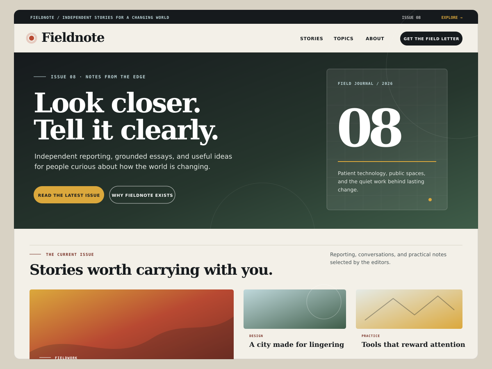
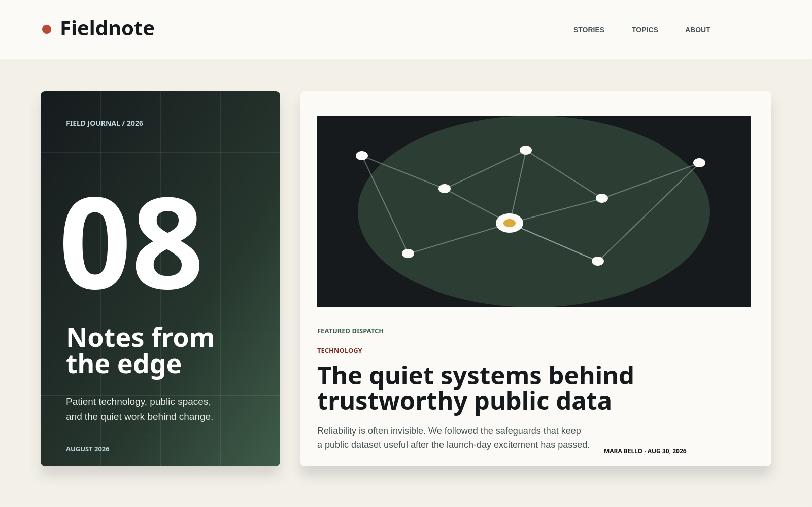

# Fieldnote

Fieldnote is a performance-minded WordPress editorial system shaped like a modern field journal. The core is a native block theme with no front-end JavaScript, remote fonts, framework, tracking, or required plugin. An optional companion plugin adds two focused dynamic Gutenberg blocks while keeping publication behavior portable across themes.

It is not a production client theme and has not been submitted to the WordPress.org theme directory.

[Open the one-click WordPress Playground demo](https://playground.wordpress.net/?blueprint-url=https%3A%2F%2Fraw.githubusercontent.com%2FDagemawiDeveloper%2Ffieldnote-block-theme%2Fmain%2Fblueprint.json)

## The editorial system

| Layer | Included |
| --- | --- |
| Templates | Front page, home, index, single, page, wide page, archive, author, search, and 404 |
| Template parts | Announcement bar, header, and footer |
| Patterns | Nine editor-facing compositions plus three hidden utility patterns for portable template links |
| Global styles | Paper-led default, Ink, and Moss |
| Section styles | Obsidian, Parchment, Signal, and Editorial Byline |
| Companion blocks | Server-rendered Issue Details and Lead Story blocks with native editor controls |
| Demonstration | One-click Playground blueprint, nine original sample stories, four local editorial images, and a block-lab page |

The front page is built as a coherent publication rather than a collection of isolated blocks: an issue-led hero, an asymmetric story mosaic, live category navigation, a high-contrast editorial statement, a deeper archive, and a reader invitation.

## WordPress 7.1, used deliberately

- **theme.json** schema version 3 with custom Mobile and Tablet viewports.
- Native **@mobile** and **@tablet** block style states for spacing and typography.
- Native Button and Navigation Link states for hover, focus-visible, active, and current-page styling.
- The new **styles.background.gradient** support for layered editorial surfaces.
- JSON-registered section and block style variations that remain available in the Site Editor.
- Content-only locking where editors should own the words without accidentally dismantling the composition.

## Engineering qualities

- Ten templates, each with one semantic **main** landmark and editable template parts.
- Visible keyboard focus, reduced-motion behavior, increased-contrast treatment, readable default contrast, and print styles.
- Responsive query compositions that adapt from editorial mosaics to a linear reading order.
- System serif, sans, and monospace stacks with fluid local type and spacing tokens.
- Block-aware Button CSS loaded with **wp_enqueue_block_style()**.
- Two metadata-registered dynamic blocks with Inspector Controls, core-data post selection, live server previews, and resilient rendering fallbacks.
- Structural and semantic validation, official WordPress JavaScript/CSS/PHP standards, Theme Review and Plugin Check, cross-browser Playwright flows, whole-page axe checks, and deterministic installable ZIPs.
- No theme front-end scripts, plugin front-end scripts, remote fonts, trackers, CSS framework, or runtime dependence on remotely hosted theme assets.

## Optional editorial blocks

The companion plugin is deliberately separate from the theme. Posts keep their editorial behavior if a publication changes its visual design, while the theme remains fully usable by itself.

- **Issue Details** provides structured issue context with editable number, title, summary, label, and date.
- **Lead Story** lets an editor select a published post through WordPress core data, choose split or stacked presentation, move the image, and control category and excerpt visibility.
- Both blocks render in PHP and use WordPress-provided editor packages. Neither adds JavaScript to the public site.

## Local setup

The quickest option uses Node 22.19 or newer and the official **@wordpress/env** package with its WordPress Playground runtime:

~~~bash
npm ci
npm run env:start
~~~

Open http://localhost:8888 and sign in with the credentials printed by wp-env. The environment mounts both the theme and the optional companion plugin. Stop it with:

~~~bash
npm run env:stop
~~~

For a manual installation, use **dist/fieldnote.zip** for the theme and **dist/fieldnote-editorial-blocks.zip** for the optional plugin.

## Explore it in the Site Editor

1. Open **Appearance → Editor** and inspect the Front Page composition.
2. Edit the Announcement, Header, or Footer template part.
3. Switch Global Styles between the default, Ink, and Moss designs.
4. Apply Fieldnote Obsidian, Parchment, Signal, or Editorial Byline to a supported container.
5. Preview responsive block styles at the configured Mobile and Tablet viewports.
6. Insert any Fieldnote pattern and confirm content-only patterns protect their structure.
7. Insert Issue Details and Lead Story, change their Inspector Controls, and confirm their server previews update.

## Checks and packaging

Run the fast validators and WordPress lint rules:

~~~bash
npm test
npm run lint
~~~

Build both installable archives:

~~~bash
npm run package
~~~

The command produces **dist/fieldnote.zip** and **dist/fieldnote-editorial-blocks.zip**. Use `npm run package:verify` to build each archive twice and compare its SHA-256 digest. GitHub Actions repeats structure, JSON, markup, contrast, supply-chain, lint, and package checks; lints PHP across 7.4, 8.2, 8.3, and 8.4; runs official WordPress theme and plugin review tools; and exercises the editor and public routes in desktop Chromium, mobile Chromium, Firefox, and WebKit.

With the local environment running, execute the browser suite with:

~~~bash
npm run test:e2e
~~~

## Engineering notes

Start with [docs/ARCHITECTURE.md](docs/ARCHITECTURE.md) for system boundaries and render flows. The reasoning behind the design, responsive system, editorial controls, accessibility approach, and performance budget is recorded in [docs/DECISIONS.md](docs/DECISIONS.md). See [docs/TEST-RESULTS.md](docs/TEST-RESULTS.md) for verified results and [docs/TESTING.md](docs/TESTING.md) for the broader manual plan.

## Current limits

- Fieldnote covers a focused editorial use case rather than commerce or application UI.
- Automated checks cannot replace manual Site Editor, keyboard, browser, assistive-technology, RTL, and representative-content testing.
- The Playground stories and publication are clearly fictional demonstration content, not reporting or production copy.

## License

Fieldnote is released under the GNU General Public License v2 or later.
